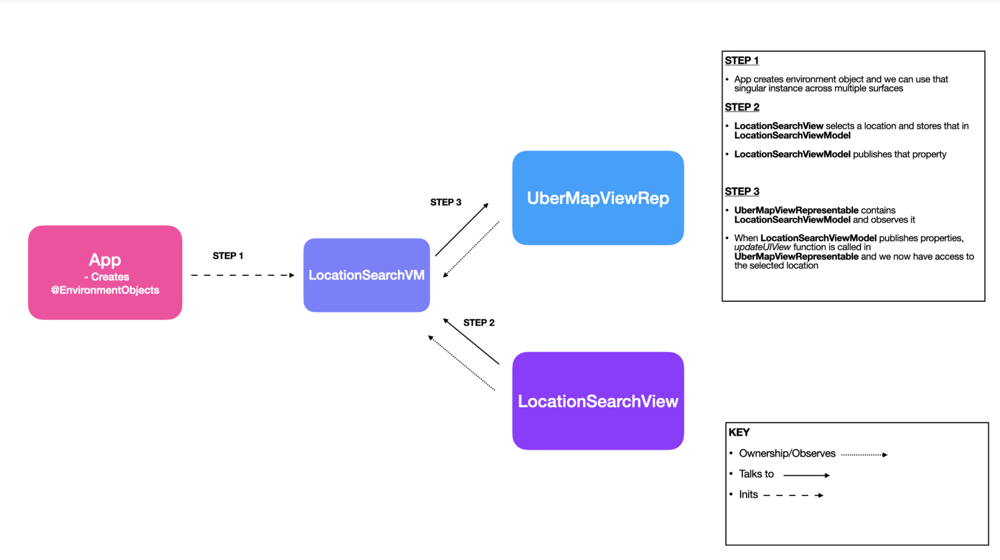
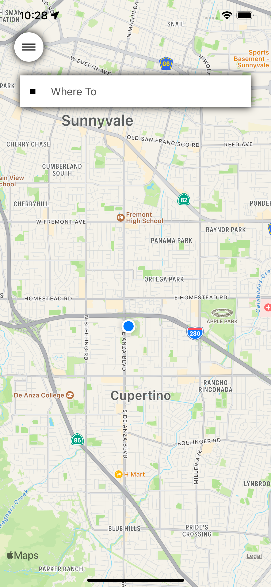
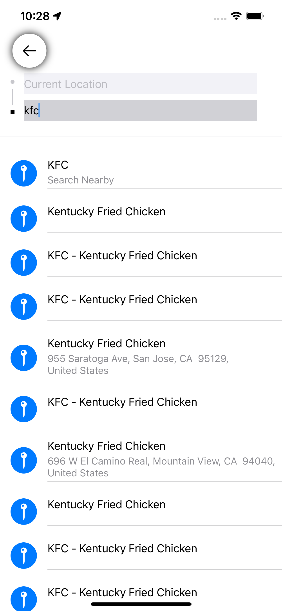
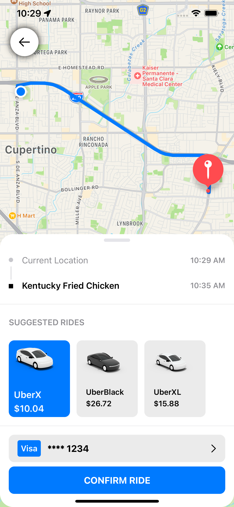
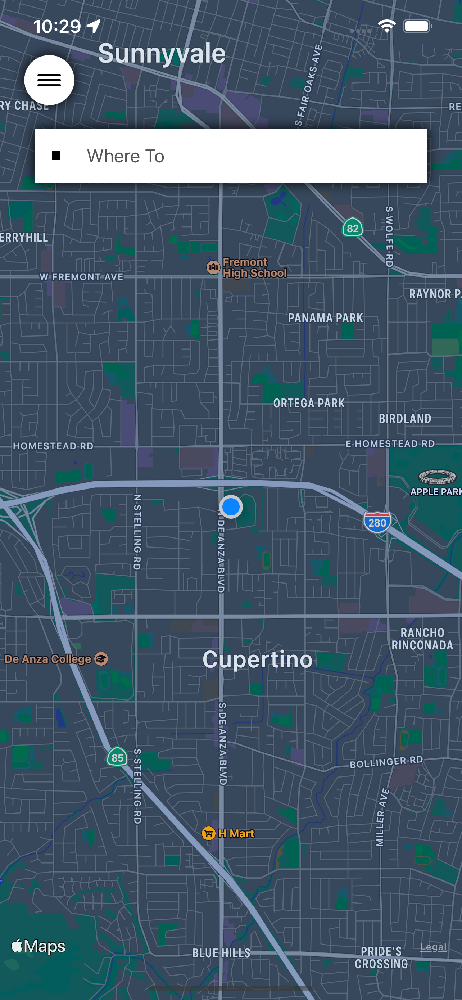
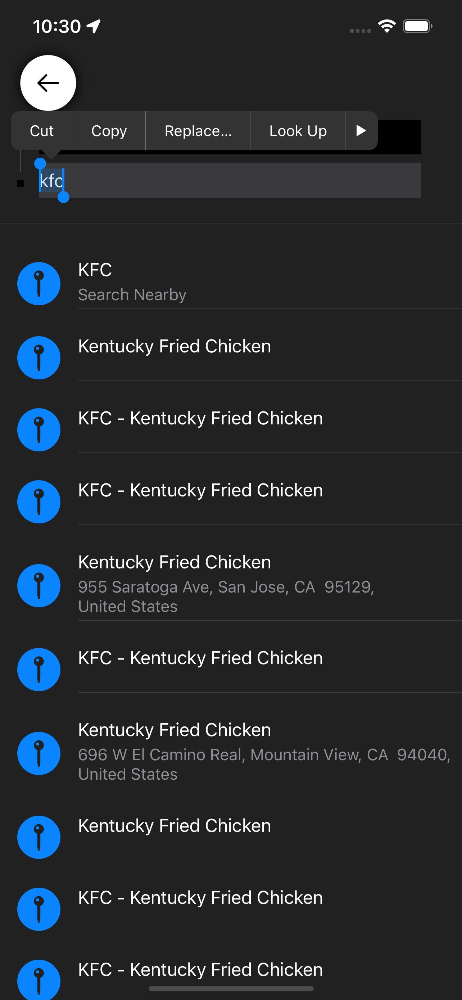
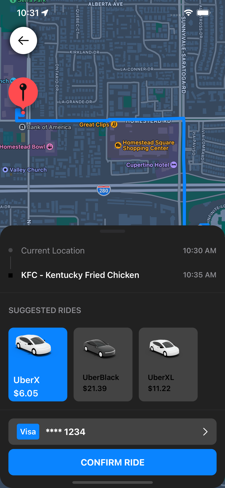

# SwiftUI-UBER UI

UBER UI Crafted From Scartch

## Architecture

Ref: [https://www.youtube.com/watch?v=Z6-KVWXbw-w](https://www.youtube.com/watch?v=Z6-KVWXbw-w)

----

## Features
- UIKIT Map
- Location Search
- Polyline
- Compute RideType Price
- Compute PickUpTime & DropOffTime
- LightTheme / DarkTheme Support

---

## LightTheme
||||
|-|-|-|

## DarkTheme
||||
|-|-|-|